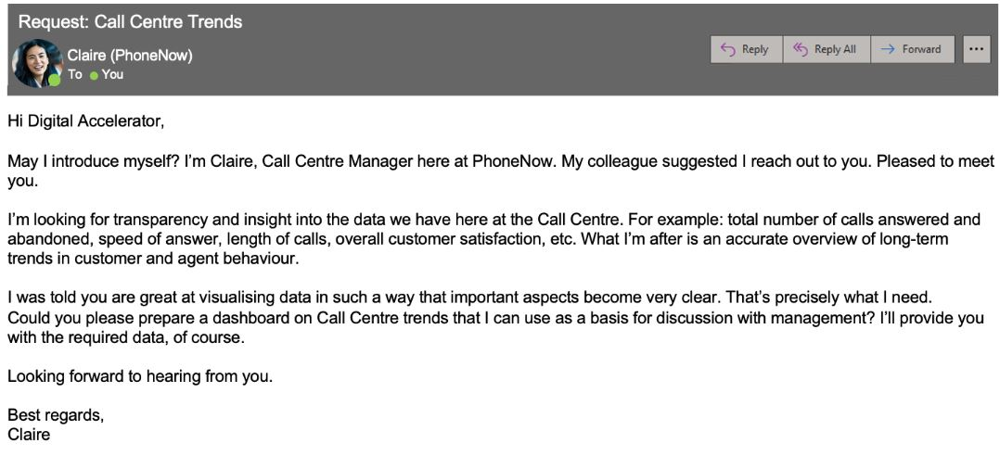
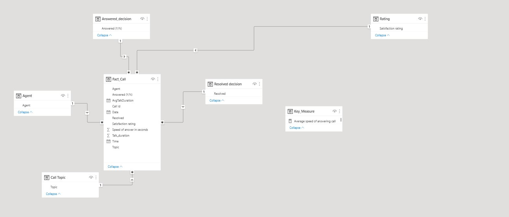
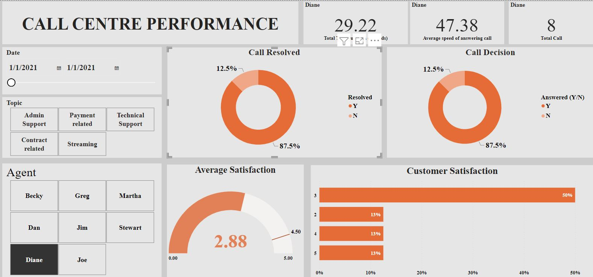

# Call Centre Performance

---
## Introduction:
This is a project on building a dasbaord based on request from a call centre to track performance

## KPI to track:
1.  Overall customer satisfaction
2.  Overall calls answered/abandoned
3.  Calls by time
4.  Average speed of answer
5.  Agent’s performance quadrant -> average handle time (talk duration) vs calls answered

6.  ## Skills/ Concept Demonstrated:

The following Power BI features were incorporated:
- DAX,
- Quick measures,
- Modelling,
- Filters

## Modelling
Automatically derived relationships are adjusted to remove and replace unwanted relationship with the required.

---
There are 6-dimentional tables and 1 fact table. The dimention tables are all joined to the fact table with a one-to-many relationship

## Dashboard:

You can interact with the Dashboard [here](https://drive.google.com/file/d/1j-ta1Ax_8uloxKBQxUIsMu6CHnpnrUq8/view?usp=drive_link)
